# Structured Meeting Intelligence

Graduation project on dialogue-act tagging and proposal-response linking over the ICSI MRDA corpus.

## Data flow

Task A's frozen release is the only thing that crosses from task A to task B; everything after it is derived and can be rebuilt. Dashed boxes are planned for the baseline phase.

```mermaid
flowchart LR
    subgraph A["Task A · data"]
        RAW["Raw corpus<br/>ICSI NXT XML + transcripts"] --> PIPE["Task A pipeline<br/>parser → labels & links → splits → release"]
    end
    PIPE -- freezes --> REL[("data/v4 release (contract)<br/>rows.jsonl · metadata.json · splits.json<br/>links.jsonl: layer 2 only")]
    subgraph B["Task B · harness"]
        SCRIPT["scripts/make_meeting_files.py<br/>checks, then writes"] -- writes --> MEET[("data/v4_meetings<br/>train/ 51 · val/ 12 · test/ 12<br/>one JSONL per meeting · source.json")]
        MEET -- "gold labels · load_gold()" --> HARN["Harness<br/>load_predictions() · P/R/F1 · macro-F1 (6)"]
        MEET -- "text · speaker · label" --> BASE["Baseline<br/>trains on train/, tunes on val/"]
        BASE -- "predictions.jsonl, joined on seg_id" --> HARN
        HARN -- "evaluate()" --> MJ["metrics.json"]
    end
    REL -- reads --> SCRIPT
    classDef contract fill:#fbefdc,stroke:#a8620c,stroke-width:2px,color:#1d2420
    classDef planned stroke-dasharray: 5 4
    class REL contract
    class BASE,MJ planned
```



## Tasks

| ID | Task | Owner | Status |
|----|------|-------|--------|
| [B](tasks/B-eval-harness/README.md) | Evaluation harness | Ahmed | in progress |

## Setup

```bash
python3 -m venv .venv               # once
source .venv/bin/activate           # in every new terminal
pip install -r requirements.txt
```

## Running the tests

From the repo root:

```bash
python -m pytest tests -v          # every test, one line each
python -m pytest tests -q          # short summary
python -m pytest tests -v -rs      # also show why tests were skipped
```

Tests that need local data (`data/`, not in git) are skipped, not failed, when the data is missing.
